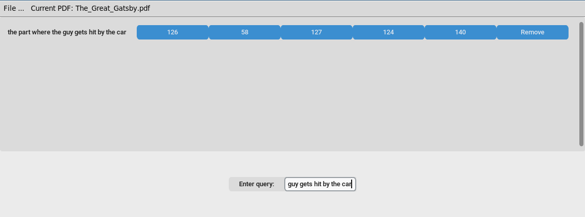
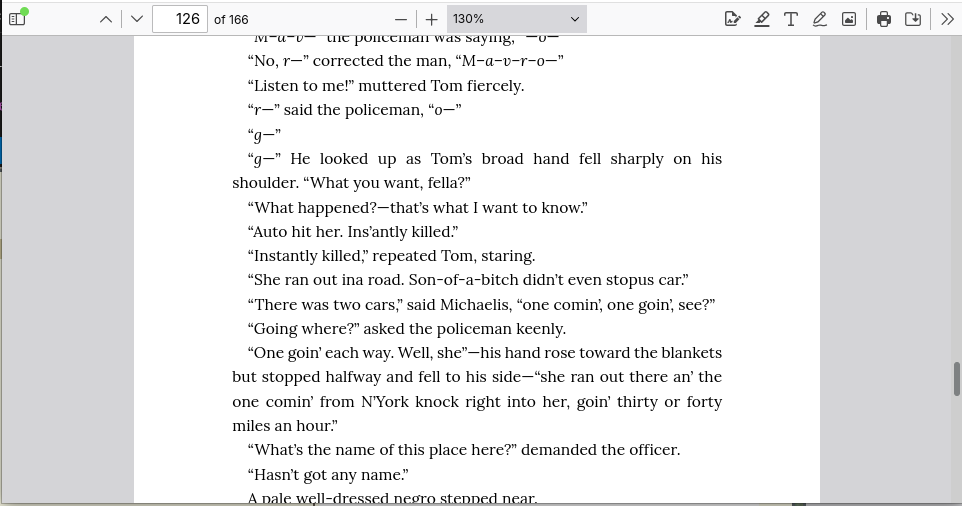
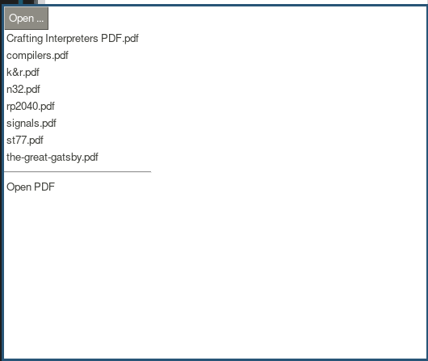
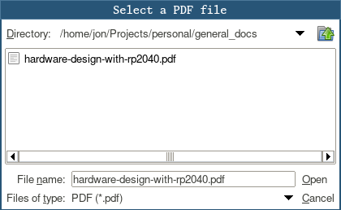
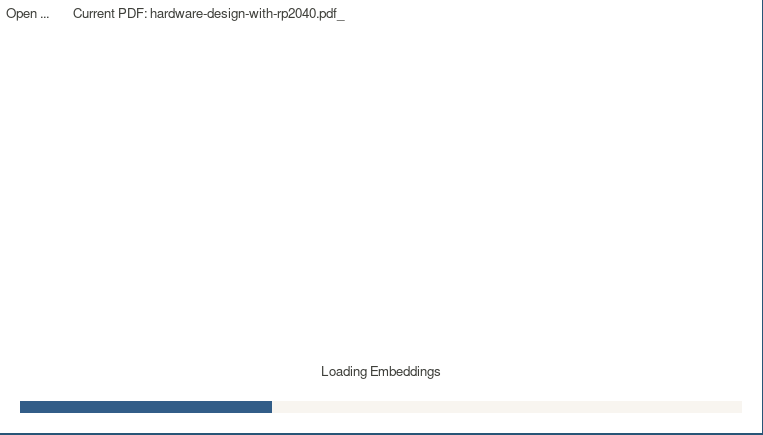
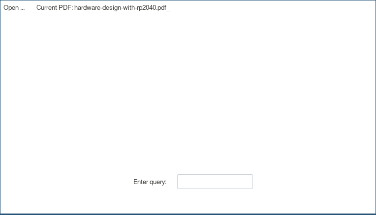
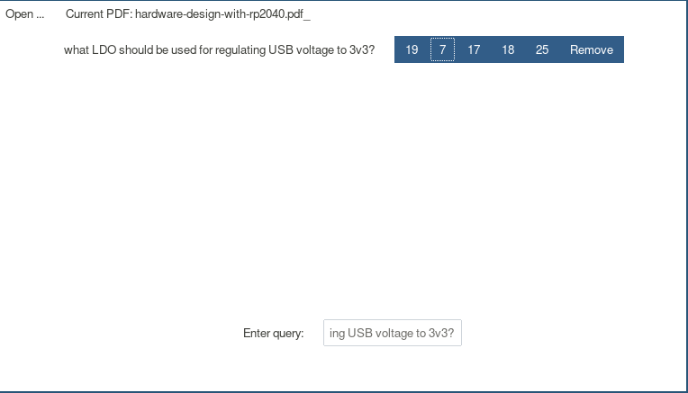
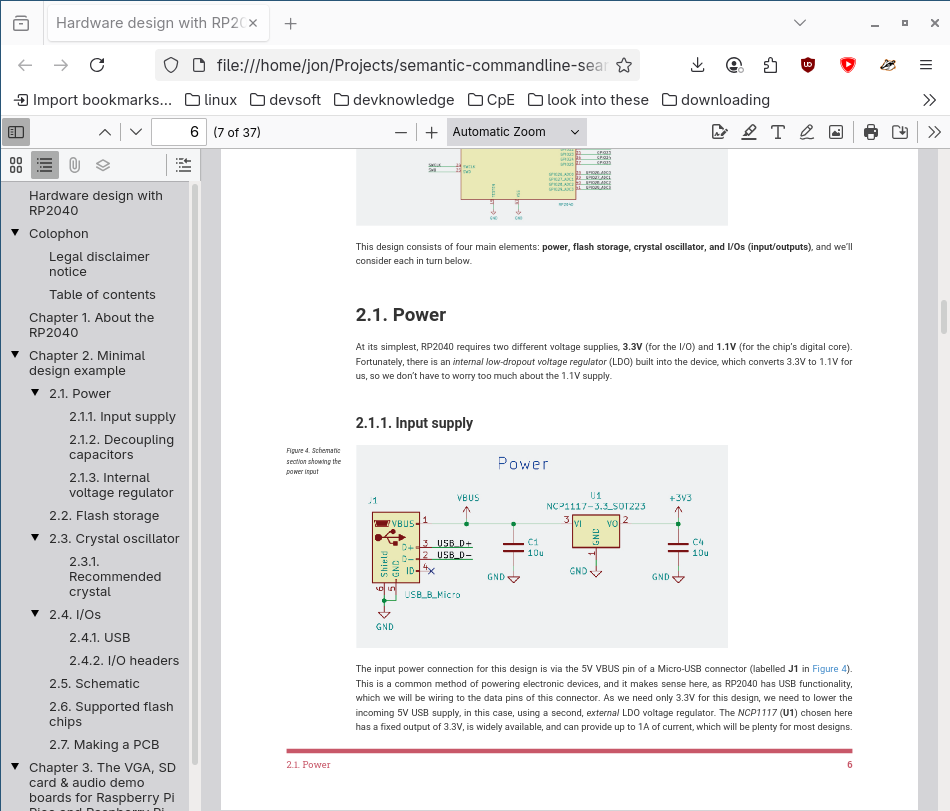

# semantic-PDF-search
By Jordan Zedeck and Jonathan Louis

A semantic PDF searching application, written in python. This application uses ML an embedding model to encode the document and the user's query, allowing for near-matches of the query to be presented to the user. The page numbers with near-matches are shown to the user as buttons which, when clicked, will open the PDF at that page in the default browser.

### Example:

### Installation:

(tbd)

### Usage tutorial:

From the command line:
`semantic-search-gui`

Browse for a new PDF:

Select a PDF and click 'Open':

Wait for the embeddings to be created and/or loaded:

Type a query and press enter:

Click on any of the results to open the PDF to that page in your default web-browser:

